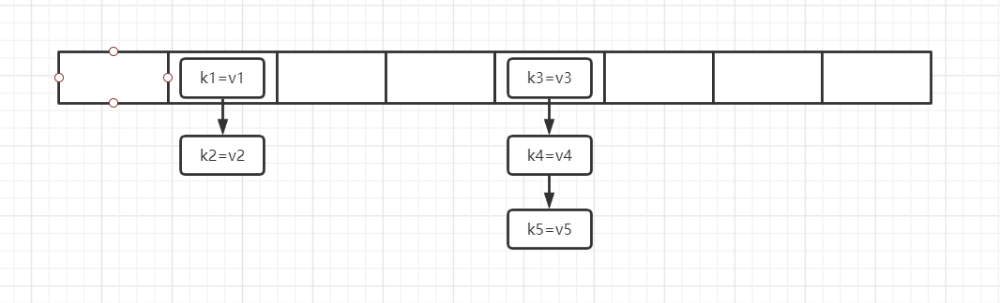

### 一、引入
```
本文主要是针对于jdk7中的HashMap进行分析, 主要分析的核心点是put和get方法,
当对这两个方法有所了解后, 大家会发现再去看其他的方法是可以很顺利的了解其实现的, 其实在大学的时候我
便通过手写红黑树的方式来对HashMap进行深入的研究, 在我的github集合源码分析一栏中有多篇文章进行了记
录, 这次是为了进一步的学习ConcurrentHashMap的原理, 从而能在项目中用该组件时更加的自信, 以接下来的
四篇文章来记录自己学习jdk7和jdk8版本的这两个组件的心得, 其中本篇文章以jdk7的HashMap进行分析
```

### 二、HashMap源码分析
#### 2.1、HashMap属性分析
```
我们先以文字的形式来聊聊JDK7版本下的HashMap原理, 进而引出JDK7中属性的作用, 如下图所示, 最外层是一
个长度为8的数组, 在进行添加操作时, 其实就是往这个数组中添加元素, 同一索引位置下的多个元素会以链表
的形式来进行连接, 这就是JDK7下HashMap的内部结构了

public class HashMap<K,V> extend ...{
  static final Entry<?,?>[] EMPTY_TABLE = {};
  Entry[] table = (Entry<K,V>[]) EMPTY_TABLE;;
  int size;
  int threshold;
  float loadFactor;
  int modCount;

  static class Entry<K,V> implements Map.Entry<K,V> {
        final K key;
        V value;
        Entry<K,V> next;
        final int hash;
  }
}

首先来看看table这个数组, 根据上面的文字可以猜到, 这就是HashMap内部存储数据的数据结构了, 通过Entry
这个对象来构成一个链表, 所以我们看看Entry这个类的定义, 非常的清晰, key、value就不用说了, next属性
表示链表的下一个元素, Entry对象中的hash属性在描述添加方法的时候我们再来分析, 所以Entry对象其实就
跟我们学习链表数据结构时了解的节点定义是一样的, 同样的, 我们可以通过只有一个next属性得出在HashMap
中每个索引位置下维护的链表是一个单向链表

size是table中元素的总个数, 而不是table这个数组的length, 换句话说, 当我们每次往HashMap中添加一个
新的元素的时候, 就会使得size加1

我们往Map中添加元素的时候, 首先通过key计算出一个哈希值, 比如通过取key的hashCode方法返回值来作为哈
希值, 再通过这个哈希值来计算这个key应该放在哪个索引下, 比如对table.length进行取模运算, 就可以将一
个>=table.length的值n计算得到索引x: [0 <= x <= table.length], 当然在HashMap中不是这样实现的,上
面仅仅是我大学学习HashMap的时候计算一个key的索引的思路而已----更多的是, 不同的元素计算出的哈希值
可能不一样, 但是却可能得到相同的索引位置, 比如11 % 10 = 1和21 % 10 = 1 , 所以当table这个数组的
长度越小的时候, 出现的这种情况的概率也越大

当我们通过空参构造方法创建了一个HashMap的时候, 默认会使得size为16, 当我们不停的往这个Map中添加
元素的时候, 一个索引下元素个数可能会越来越多, 那么就会使得查找、遍历的效率越来越低(链表的查询效率是
O(N)级别的), 为了尽可能的提高查询效率, 当整个HashMap中元素个数即size达到阈值的时候, 就需要对
HashMap进行扩容, 即增大数组的长度, 尽可能的减少一个索引位置下的链表长度, 而这个阈值就是threshold
这个属性对应的值, 这个阈值通过table.length * loadFactor计算得出, loadFactor也称为负载因子, 默认
值是0.75, 数组的长度默认为16, 所以当数组中元素个数达到16 * 0.75即12的时候就会进行扩容了(当然还有
一个额外的条件满足的情况下才会进行扩容, 这个额外的条件我们放在源码分析的时候再来看, 这里可以不用理
会), 负载因子设置为0.75是经过前人大量的实验得出的, 通常情况下我们不会去修改这个值

modCount这个属性可以认为是modify count的缩写, 即更改次数, 每次对HashMap进行增删改操作的时候就会
使得这个modCount 加1, 其作用是在为了防止并发修改的, 比如我们在遍历的过程中, 其他线程对HashMap进行
了增删改操作, 即调用了put、remove这样的方法, 那么该参数就是为了防止继续遍历下去的, 因为此时遍历的
结果可能是不准确的, 当我们通过迭代器Iterator进行遍历的时候, 创建该迭代器时就会保存一份modCount的
副本, 如果在遍历的过程中, 有增删改操作发生, 那么就会使得modCount发生改变, 每次遍历的时候会先判断
modCount和副本中的那个值是否相等, 如果不等, 就抛出一个并发修改异常, 这在HashMap中也称为快速失败

到此为止, 我们就对HashMap中涉及的属性的作用就分析完了, 并对HashMap中内部存储数据的结构以及一些原理
进行了分析, 接下来我们开始分析源码
```



#### 2.2、构造方法
```java
public HashMap() {
    this(DEFAULT_INITIAL_CAPACITY, DEFAULT_LOAD_FACTOR);
}
public HashMap(int initialCapacity, float loadFactor) {
    this.loadFactor = loadFactor;
    threshold = initialCapacity;
    init();
}

DEFAULT_LOAD_FACTOR为0.75, DEFAULT_INITIAL_CAPACITY为16, 在这里仅仅是进行了赋值而已, 可能会觉
得奇怪的是, threshold方法的值默认变成了16, 然而在第一次调用添加方法的时候才会对数组进行真正的初始
化, 那个时候会对threshold进行更新, init方法是一个空方法, 在HashMap中没有进行实现
```

#### 2.3、计算一个元素应该添加到哪个索引位置
```java
static int indexFor(int h, int length) {
    // assert Integer.bitCount(length) == 1 : "length must be a non-zero power of 2";
    return h & (length-1);
}

当我们在对一个key进行哈希值计算后, 会利用这个哈希值计算出一个索引, 从而才能将这个key-value放置进
去, 在之前的分析中, 我是通过取模的方法来对索引进行计算的, 而在HashMap中却是通过hashCode与
table.length进行与操作进行计算所得, 之所以这样能计算出索引的原因是, table这个数组的长度被控制为了
2的幂次方, 即只能是[0001、0010、0100、1000]这样一串二进制中只能有一个1的形式, 当这样形式下的值减
去1的情况下, 就会变成高位全是0, 低位全是1的形式, 这样无论一个多大的值与该值进行与操作, 高位就能全
是0, 从而保留了低位, 这样计算出来的值一定是小于table.length的
```

#### 2.4、数组初始化方法
```java
private void inflateTable(int toSize) {
    // Find a power of 2 >= toSize
    int capacity = roundUpToPowerOf2(toSize);

    threshold = (int) Math.min(capacity * loadFactor, MAXIMUM_CAPACITY + 1);
    table = new Entry[capacity];
    initHashSeedAsNeeded(capacity);
}

先计算出一个capacity, 之后会作为table数组的大小, 在put方法中inflateTable方法的参数为threshold,
在上一小节中我们知道该属性初始化的值为16, 根据注释可以看到, 利用roundUpToPowerOf2方法计算出一个大
于等于toSize(threshold)的值, 并且这个值是2的幂次方, 这个值即作为了table这个数组的长度, 从而我们
可以看到threshold也得到了更新, 变成了capacity与loadFactor的乘积, 即默认为16 * 0.75 = 12

initHashSeedAsNeeded方法大家有兴趣可以去了解下, 是一个可以用来扩展哈希值计算方法, 通常情况下我们
也不会进行这样的操作, 而且这种操作在jdk8就已经被移除了
```

#### 2.5、hash方法
```java
final int hash(Object k) {
    int h = hashSeed;
    if (0 != h && k instanceof String) {
        return sun.misc.Hashing.stringHash32((String) k);
    }

    h ^= k.hashCode();

    h ^= (h >>> 20) ^ (h >>> 12);
    return h ^ (h >>> 7) ^ (h >>> 4);
}

hash方法的参数k其实就是我们往map中存储元素时提供的key对象, 利用这个key来计算一个哈希值, 从而再利用
这个哈希值和table.length进行与运算计算出索引

通常情况下, hashSeed是为0的, 所以h也为0, 我们先从k.hashCode()这一段开始看起, h为0的情况下与
k.hashCode()方法的返回值进行异或操作, 其实值还是k.hashCode(), 重要的是最后两行对h的进一步计算,
其实就是对这个key的hashCode方法的返回值进行进一步的哈希计算而已, 从而减少哈希冲突的概率, 而方法最
开始的三行代码就不进行分析了, 大家有兴趣可以去了解下, 也跟哈希计算有关, 这几行代码其实在jdk8版本的
情况下已经被删除了
```

#### 2.6、put方法
```java
public V put(K key, V value) {
    if (table == EMPTY_TABLE) {
        inflateTable(threshold);
    }
    if (key == null)
        return putForNullKey(value);
    int hash = hash(key);
    int i = indexFor(hash, table.length);
    for (Entry<K,V> e = table[i]; e != null; e = e.next) {
        Object k;
        // 主要是通过key的==操作或者key的equals方法来判断两个key是否相等, 最前面的e.hash和hash
        // 的==判断能够更快的过滤掉不合适的key!!
        if (e.hash == hash && ((k = e.key) == key || key.equals(k))) {
            V oldValue = e.value;
            e.value = value;
            e.recordAccess(this);
            return oldValue;
        }
    }

    modCount++;
    addEntry(hash, key, value, i);
    return null;
}

根据上面对属性的分析中, 我们知道table默认就是EMPTY_TABLE, 所以第一次调用添加方法的时候就会利用
inflateTable方法来进行数组的初始化

如果key为null, 就会执行相应的添加逻辑, 在HashMap中就是将其添加到索引为0的位置下, 当对put方法后面
的代码都熟悉了以后, 这个putForNullKey方法的源码也会很清晰, 因为都差不多

根据key计算出一个hash哈希值, 根据哈希值和table.length计算出索引i, 即这个key-value构成的Entry对象
就会被添加到索引i这个位置对应的链表中, 先通过一个for循环, 对索引i这个位置下的链表进行遍历, 查找是
否key已经存在, 如果存在就直接进行值的替换了, 并返回旧的值, 如果for循环结束的情况下, 没有找到key对
应的Entry, 那么就会利用addEntry方法进行真正的添加操作

void addEntry(int hash, K key, V value, int bucketIndex) {
    if ((size >= threshold) && (null != table[bucketIndex])) {
        resize(2 * table.length);
        hash = (null != key) ? hash(key) : 0;
        bucketIndex = indexFor(hash, table.length);
    }

    createEntry(hash, key, value, bucketIndex);
}

如果当前数组中元素的个数已经大于了阈值, 并且该索引位置下没有元素, 那么才会进行扩容操作, 进行了扩容
操作后, 会重新计算索引, 最后调用createEntry方法将元素添加到对应索引位置下, 在if判断中, 还有一个
hash方法的调用, 这个方法的调用通常是不会有变化的, 当经过扩容后hashSeed属性发生了改变的情况下hash
方法才会计算出一个新的哈希值, 但是由于hashSeed这个属性以及相应的操作在jdk8已经移除了, 所以我们上面
的分析中也进行了跳过, 即hash方法通常情况下返回的值和addEntry方法传入的hash值是一样的

void createEntry(int hash, K key, V value, int bucketIndex) {
    Entry<K,V> e = table[bucketIndex];
    table[bucketIndex] = new Entry<>(hash, key, value, e);
    size++;
}

addEntry方法就是创建一个Entry对象, 然后添加到table数组buckeyIndex索引这个链表的头部, 之所以可以
直接添加到头部是因为我们在put方法一开始就对key是否已经存在进行了判断, 到了createEntry方法的时候必
然就可以直接添加了
```

#### 2.7、resize扩容方法
```java
void resize(int newCapacity) {
    Entry[] oldTable = table;
    int oldCapacity = oldTable.length;
    if (oldCapacity == MAXIMUM_CAPACITY) {
        threshold = Integer.MAX_VALUE;
        return;
    }

    Entry[] newTable = new Entry[newCapacity];
    transfer(newTable, initHashSeedAsNeeded(newCapacity));
    table = newTable;
    threshold = (int)Math.min(newCapacity * loadFactor, MAXIMUM_CAPACITY + 1);
}

在addEntry方法中调用resize方法的时候, 传入的参数值为2 * table.length, 即扩大为原数组的两倍, 我们
来看看resize方法, 如果数组的长度已经达到了规定的最大值, 则更新threshold为Integer的最大值, 然后就
直接返回了, 这里不会再对数组进行扩容操作

如果数组的长度没有达到规定的最大值, 那么就会创建一个新的数组, 然后调用transfer方法将旧数组的元素一
个个转移到新的数组上来, 可以看到transfer方法第二个参数需要调用initHashSeedAsNeeded方法, 这个参数
我们进行忽略

void transfer(Entry[] newTable, boolean rehash) {
    int newCapacity = newTable.length;
    for (Entry<K,V> e : table) {
        while(null != e) {
            Entry<K,V> next = e.next;
            if (rehash) {
                e.hash = null == e.key ? 0 : hash(e.key);
            }
            int i = indexFor(e.hash, newCapacity);
            e.next = newTable[i];
            newTable[i] = e;
            e = next;
        }
    }
}

最外层的for循环用于遍历数组中的每个索引, 内层的循环用于遍历每隔索引下的链表, 其实内层循环的操作除了
indexFor方法是重新计算索引位置外, 其他的都是链表操作了, 这里就不进行详细分析, 这是数据结构的基础,
相信大家理解起来会很容易, rehash这个参数我们进行忽略, 在jdk8已经被移除了
```

#### 2.8、get方法
```java
public V get(Object key) {
    if (key == null)
        return getForNullKey();
    Entry<K,V> entry = getEntry(key);
    return null == entry ? null : entry.getValue();
}

如果key为null, 就走getForNullKey的逻辑, 否则走getEntry逻辑, getForNullKey跟getEntry类似, 只不
过少了一半索引的计算而已, 直接从索引为0的链表中进行查找操作

final Entry<K,V> getEntry(Object key) {
    if (size == 0) {
        return null;
    }

    int hash = (key == null) ? 0 : hash(key);
    for (Entry<K,V> e = table[indexFor(hash, table.length)];
          e != null;
          e = e.next) {
        Object k;
        if (e.hash == hash &&
            ((k = e.key) == key || (key != null && key.equals(k))))
            return e;
    }
    return null;
}

通过hash方法计算一个哈希值, 通过indexFor方法计算索引, 然后通过一个for循环对链表进行遍历, 从而查找
对应key的value值
```
