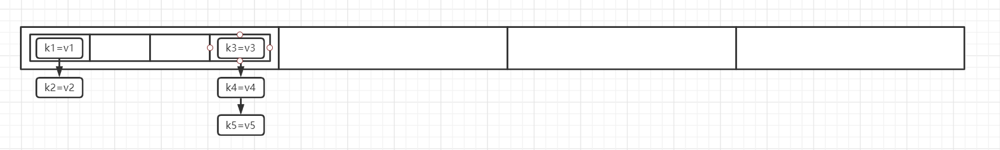

### 一、Unsafe的使用
#### 1.1、获取Unsafe
```
本篇文章涉及到的代码的JDK版本是1.7
Unsafe, 顾名思义是不安全的, 其里面提供的方法都是较为底层的操作, 比如能够直接操作堆外内存, 比如
synchronized底层用到的monitorEnter和monitorExit同步功能等等, Unsafe对象默认的构造方法是private
所以我们需要通过反射的方式来获取这个对象

Constructor<Unsafe> declaredConstructor = Unsafe.class.getDeclaredConstructor();
declaredConstructor.setAccessible( true );
Unsafe unsafe = declaredConstructor.newInstance();
```

#### 1.2、Unsafe操作普通对象
```java
class Person {
	private String username;

  /* getter / setter */
}

Person person = new Person();
person.setUsername( "zhangsan" );
System.out.println( person.getUsername() );
unsafe.putObjectVolatile( person,
      unsafe.objectFieldOffset( Person.class.getDeclaredField( "username" ) ), "lisi" );
System.out.println( person.getUsername() );

假设我们有一个Person类, 同时在main方法中创建了一个person对象, 开始的时候设置为zhangsan, 然后调用
了unsafe的putObjectVolatile, 会发现, 第一次打印的是zhangsan, 但是第二次打印的就是lisi了

unsafe.objectFieldOffset方法用于获取一个对象的某个属性在内存中的偏移量, 通过上面的代码, 我们获取
了username这个属性在内存的偏移量, 或者我们可以这么理解, 我们一个对象存储在堆中的时候, 是占据了一块
连续的空间, 而对象中的属性就放置在这块空间的某个位置, 即偏移量, 当我们知道一个对象在内存中的位置的
时候, 再根据属性的偏移量, 就能得出这个属性在内存中的位置, 从而可以直接操控内存了

unsafe.putObjectVolatile, 就是用于更新一个属性的值, 比如更新person对象的username属性, 更新这个
属性, 就需要获取属性的偏移量, 即利用objectFieldOffset方法

unsafe还有一个putOrderedObject方法, 其参数和功能跟putObjectVolatile是一样的, 不同的地方在于, 前
者是快速写入, 不保证内存的可见性, 而后者有volatile语义, 能够保证内存的可见性, 所以两个方法的区别为
是否保证了内存的可见性
```

#### 1.3、Unsafe操作数组
```java
String[] arr = new String[]{ "zhangsan1", "zhangsan2", "zhangsan3" };
long firstElementOffset = unsafe.arrayBaseOffset( arr.getClass() );
long perElementSize = unsafe.arrayIndexScale( arr.getClass() );
unsafe.putOrderedObject( arr, firstElementOffset + perElementSize , "lisi" );
System.out.println(Arrays.toString( arr ) );

数组在堆中的存储也是一段连续的空间, unsafe.arrayBaseOffset方法用于获取数组中第一个元素在内存的偏
移量, unsafe.arrayIndexScale用于获取数组中每个元素占据内存的大小, 所以当我们要获取第二个元素在内
存中的偏移量的时候, 只需将这两个方法的返回值进行相加就可以得到了, 上面的代码就是一个简单的例子, 通
过输出结果我们可以发现, 第二个元素已经变成了lisi
```

### 二、ConcurrentHashMap源码分析
#### 2.1、理论分析
```
我们知道HashMap是线程不安全的, 为了能够使得HashMap的操作是线程安全的, 我们通常会将这些操作放置在
一个同步块中, 然而这就会使得HashMap的操作是并行的, 效率就受到了极大的影响, 而ConcurrentHashMap则
对这种情况进行了改善, 我们对HashMap进行同步操作的时候, 是使得整个HashMap的每一步操作都放置在同步
块中, 而ConcurrentHashMap则是进行了拆分, 使得一个put操作仅仅锁住一部分的数据, 这样就极大的提高了
并发的程度, 如下图所示, 是ConcurrentHashMap的内部数据结构, 在最外层有一个数组X, 数组X中每个索引下
又有一个数组Y, 数组Y中每个索引下维护了一个链表, 其实联合上一篇对HashMap源码的分析, 我们其实可以发
现数组Y其实就是一个HashMap数据结构, 确实如此

当我们进行添加操作的时候, 会先计算出该key-value在数组X中的索引, 然后再计算出在数组Y中的索引, 最后
执行添加操作, 而为了并发安全与提高并发程度, 我们的锁仅仅会锁住数组Y, 换句话说, 数组X中的每个单独的
数组Y都会拥有一把独立的锁, 一次put操作, 仅仅会锁住对应的数组Y, 而不会把整个数组X给锁住
```



#### 2.2、数据结构分析
```java
static final class HashEntry<K,V> {
    final int hash;
    final K key;
    volatile V value;
    volatile HashEntry<K,V> next;
}

在上一小节中, 我们知道数组Y其实是和HashMap的结构一样的, 而HashEntry就是数组Y中每个元素的存储结构
可以看到, 跟HashMap中的Entry是一样的

static final class Segment<K,V> extends ReentrantLock{
  volatile HashEntry<K,V>[] table;
  int modCount;
  int count;
  int threshold;
  float loadFactor;
}

数组X中每个元素是Segment对象, 根据上一小节中的分析可以知道, 每个Segment对象应该有自己独立的一把锁
而Segment对象则是通过继承于ReentrantLock来保证自己独立的一把锁的, 更多的是, 每个Segment对象中会
维护一个HashEntry构成的table, 即我们说的数组Y, 同时Segment中还会有modCount、count(等价于
HashMap中的size)、threshold、loadFactor, 这些在HashMap中都是存在的, 所以说Segment对象其实就像
是一个小型的HashMap, 而ConcurrentHashMap就像是由一个个的HashMap构成, 对每个HashMap的操作通过
ReentrantLock保证了并发安全

在ConcurrentHashMap中, Segment数组本身是不会进行扩容的, 而Segment中的HashEntry数组却是会进行扩
容, 所以Segment数组的长度其实可以认为是并发级别, 长度越长, 则每个Segment中的元素可能就会越少, 并
发程度就更高了, 长度越短, 则每个Segment中的元素可能就会越多, 并发程度就更低了
```

#### 2.3、构造方法分析
```java
public ConcurrentHashMap() {
    this(DEFAULT_INITIAL_CAPACITY, DEFAULT_LOAD_FACTOR, DEFAULT_CONCURRENCY_LEVEL);
}

public ConcurrentHashMap(int initialCapacity, float loadFactor, int concurrencyLevel) {
    ............................
}

initialCapacity指的是数组X中所有数组Y大小的总和, 即所有HashEntry数组加起来的大小, loadFactor即
负载因子, 数组Y的长度与负载因子的乘积, 则是该数组Y进行扩容时需要达到的元素个数阈值大小,
concurrencyLevel则是并发级别, 即用于表示Segment[]这个数组的长度, 然而因为有参构造方法是public
的, 所以允许开发者自己提供参数值, 根据上一篇文章对HashMap的源码分析, 我们了解到了, 计算一个元素应
该放到哪个索引位置, 是采用元素计算得到的哈希值和数组的长度进行与操作得到的, 而其中一个限制就是数组
的长度必须是2的幂次方, 所以这个带参数的构造方法中, 需要根据用户传入的值计算出一个大于该值的并且是2
的幂次方的值, 最后才创建数组

public ConcurrentHashMap(int initialCapacity, float loadFactor, int concurrencyLevel) {
    if (concurrencyLevel > MAX_SEGMENTS)
        concurrencyLevel = MAX_SEGMENTS;
    // Find power-of-two sizes best matching arguments
    int sshift = 0;
    int ssize = 1;
    while (ssize < concurrencyLevel) {
        ++sshift;
        ssize <<= 1;
    }
    this.segmentShift = 32 - sshift;
    this.segmentMask = ssize - 1;
    ..............................
}
第一段代码, 其实就是为了计算出Segment数组的大小, 即sszie(segment size), sszie初始为0001, 利用一
个while循环, 找到第一个大于concurrencyLevel的2的幂次方的值, 从而确定了segment数组的长度, 而
segmentMask则是用于计算一个元素应该放在segment数组的哪个索引下时用于与操作的值, 即根据一个元素计算
出一个hash值后, 再根据hash & segmentMask来获取索引, 所以segmentMask必须是ssize - 1, 而其原因在
分析HashMap源码的时候已经进行详细分析了(保证高位均为0, 低位均为1), segmentShift是用于之后利用
Unsafe对象操作Segment数组中的元素的, 之后我们再进行分析

public ConcurrentHashMap(int initialCapacity, float loadFactor, int concurrencyLevel) {
  if (initialCapacity > MAXIMUM_CAPACITY)
      initialCapacity = MAXIMUM_CAPACITY;
  int c = initialCapacity / ssize;
  if (c * ssize < initialCapacity)
      ++c;

  int cap = MIN_SEGMENT_TABLE_CAPACITY;
  while (cap < c)
      cap <<= 1;

  .....................................
}
第二段代码, 首先通过initialCapacity / ssize获取每个Segment对象中HashEntry的平均大小, 如果
initialCapacity为17, 而ssize为16, 那么经过触发后得到的值就是1了, 所以此时会有余数, 这个时候会使
得c进行加1操作, 确保总的容量是大于等于initialCapacity的

然而, 我们认为, 每个Segment对象中维护的应该是一个小型的HashMap, 所以HashEntry数组的容量应该也是
2的幂次方, 所以cap先设置为为最小的2的幂次方, 当其小于c的时候, 就进行左移操作, 从而获取到第一个大于
等于c的值, 并且这个值是2的幂次方, 这个值就是HashEntry数组的大小

public ConcurrentHashMap(int initialCapacity, float loadFactor, int concurrencyLevel) {
    // create segments and segments[0]
    Segment<K,V> s0 =
        new Segment<K,V>(loadFactor, (int)(cap * loadFactor),
                          (HashEntry<K,V>[])new HashEntry[cap]);
    Segment<K,V>[] ss = (Segment<K,V>[])new Segment[ssize];
    UNSAFE.putOrderedObject(ss, SBASE, s0); // ordered write of segments[0]
    this.segments = ss;
}
第三段代码, 开始初始化ConcurrentHashMap中的数组了, 创建一个Segment对象, 设置为s0, 原因是通过将这
个对象存储在Segment数组索引为0的位置下, 之后的添加操作中, 如果Segment[]数组其他位置需要创建该对象
时, loadFactor、HashEntry数组的长度等都可以通过s0来获取
在此之后, 创建Segment数组ss, 最后赋值给segments这个成员属性, 并且利用UNSAFE.putOrderedObject,
指定偏离量为SBASE(Segment数组中索引为0的偏移量, 在static块中初始化), 从而将s0放到了Segment数组
索引为0的位置
```

#### 2.4、put方法
1、整体分析
```java
public V put(K key, V value) {
    Segment<K,V> s;
    if (value == null)
        throw new NullPointerException();
    int hash = hash(key);
    int j = (hash >>> segmentShift) & segmentMask;
    if ((s = (Segment<K,V>)UNSAFE.getObject          // nonvolatile; recheck
            (segments, (j << SSHIFT) + SBASE)) == null) //  in ensureSegment
        s = ensureSegment(j);
    return s.put(key, hash, value, false);
}

利用hash方法计算出key对应的哈希值, 这个hash方法跟HashMap中的有点类似, 有兴趣的可以去研究下细节,
(hash >>> segmentShift) & segmentMask, 这一段代码, 是用来计算key应该放在哪个Segment中的, 即计
算Segment[]数组的索引, 所以需要跟segmentMask(上面的分析中可以得到这个值为Segment数组的长度 - 1)
进行与操作, segmentShift被称为段偏移量, 在构造方法中被赋予值, 计算Segment数组长度的时候, 需要获
得一个大于等于concurrentLevel的值, 并且这个值是2的幂次方, 所以会涉及到左移操作, 而segmentShift则
等于32减去左移的位数, 比如左移了4位, 那么在计算key对应的索引的时候, 就会使得哈希值右移
(32 - 4 = 28)位, 从而只保留了高四位, 利用高四位与segmentMask进行与操作从而获取到一个合适的索引

取到了索引j以后, 通过Unsafe的getObject方法获取到Segment数组中对应索引j所在的Segment对象, 如果
这个对象为空, 则利用ensureSegment来创建这个对象, 最后调用Segment对象的put方法将key-value给放入
到HashEntry[]数组合适的位置上

根据之前我们对Unsafe对象的操作分析, 获取一个数组指定索引位置, 需要用到arrayBaseOffset方法获取数
组中第一个元素的偏移量以及利用arrayIndexScale方法获取到数组中每个位置占据的对象大小, 在static块
中有如下代码:
    Class sc = Segment[].class;
    SBASE = UNSAFE.arrayBaseOffset(sc);
    ss = UNSAFE.arrayIndexScale(sc);
    SSHIFT = 31 - Integer.numberOfLeadingZeros(ss);

(j << SSHIFT) + SBASE), 这段代码等价于j * UNSAFE.arrayIndexScale(Segment[].class) + c, 即获
取Segment数组中索引位置为j的Segment对象, 大家有兴趣的话可以去写个demo试试, 所以put方法中的第二个
if判断的功能就清晰了: 获取Segment[]数组索引位置为j的Segment对象
```

2、ensureSegment方法创建Segment对象
```java
private Segment<K,V> ensureSegment(int k) {
    final Segment<K,V>[] ss = this.segments;
    long u = (k << SSHIFT) + SBASE; // raw offset
    ................
}
先来看这两行代码, 有了上面的分析后, 我们可以很清楚的了解到, 这就是获取Segment[]数组中索引位置为k
中对应的Segment对象的偏移量

private Segment<K,V> ensureSegment(int k) {
    ..........................
    Segment<K,V> seg;
    if ((seg = (Segment<K,V>)UNSAFE.getObjectVolatile(ss, u)) == null) {
        Segment<K,V> proto = ss[0]; // use segment 0 as prototype
        int cap = proto.table.length;
        float lf = proto.loadFactor;
        int threshold = (int)(cap * lf);
        HashEntry<K,V>[] tab = (HashEntry<K,V>[])new HashEntry[cap];
        if ((seg = (Segment<K,V>)UNSAFE.getObjectVolatile(ss, u))
            == null) { // recheck
            Segment<K,V> s = new Segment<K,V>(lf, threshold, tab);
            while ((seg = (Segment<K,V>)UNSAFE.getObjectVolatile(ss, u))
                    == null) {
                if (UNSAFE.compareAndSwapObject(ss, u, null, seg = s))
                    break;
            }
        }
    }
    return seg;
}

如果索引位置为k中Segment对象为空, 那么就取得索引位置为0中的Segment对象, 在构造方法的分析中, 我们
知道在Segment数组初始化完成后会往索引位置为0的地方放入一个Segment对象, 这样之后其他索引位置就能利
用这个对象中保留的属性来创建Segment对象

随后初始化HashEntry数组的, 以及threshold负载因子, 因为ConcurrentHashMap要保证多线程安全, 即可能
在多线程中调用, 所以在完成上述工作后再一次判断索引位置为k的地方是否有其他线程已经放入了Segment对象

如果没有, 则创建Segment对象, 然后利用一个while循环, 并且利用CAS来将Segment对象放入到对应的索引位
置, 只有当CAS更新成功, 或者从索引位置为k中取到了Segment对象时, 才会退出while循环, 即最后这个
while循环加CAS就是用来保证多线程情况下并发安全的
```

3、Segment对象的put方法
```java
final V put(K key, int hash, V value, boolean onlyIfAbsent) {
    HashEntry<K,V> node = tryLock() ? null :
        scanAndLockForPut(key, hash, value);
    V oldValue;
    try {
        .....................
    } finally {
        unlock();
    }
    return oldValue;
}

先来看看这段缩减后的代码, 最上层是一个拿锁的操作, 然后利用try...finally语句来完成释放锁的操作,
根据文章开头对ConcurrentHashMap的理论分析中, 我们知道, ConcurrentHashMap采用的是分段锁, 即每次
put操作只会锁住一段数据, 即只会锁住一个Segment对象中的HashEntry[]数组, 而这个锁的来源是Segment
对象本身, 因为Segment对象继承了ReentrantLock, 所以拥有ReentrantLock所有的方法

在这第一段代码中, 先通过tryLock尝试获取锁, 如果没有获取成功(有其他线程在持有锁), 则调用
scanAndLockForPut方法不停的获取锁, 由于第一次的tryLock没有获取到锁, 此时为了能够做一些其他的事
情, 从而提高性能, 所以在scanAndLockForPut方法中会计算key对应在HashEntry数组中的索引, 进而扫描该
索引下的链表中是否存在对应的值, 如果不存在, 则会创建对应的HashEntry对象, 进而返回, 所以这个node其
实就是当key-value所在的HashEntry链表中没有对应key时创建的, 这样就能够在try...finally语句块中直
接进行添加操作, 而可以省去创建HashEntry的时间了, 可见, ConcurrentHashMap的作者对性能的要求是很极
致的

final V put(K key, int hash, V value, boolean onlyIfAbsent) {
    ..........................................
    HashEntry<K,V>[] tab = table;
    int index = (tab.length - 1) & hash;
    HashEntry<K,V> first = entryAt(tab, index);
    for (HashEntry<K,V> e = first;;) {
        if (e != null) {
            K k;
            if ((k = e.key) == key ||
                (e.hash == hash && key.equals(k))) {
                oldValue = e.value;
                if (!onlyIfAbsent) {
                    e.value = value;
                    ++modCount;
                }
                break;
            }
            e = e.next;
        }
        else {
            if (node != null)
                node.setNext(first);
            else
                node = new HashEntry<K,V>(hash, key, value, first);
            int c = count + 1;
            if (c > threshold && tab.length < MAXIMUM_CAPACITY)
                rehash(node);
            else
                setEntryAt(tab, index, node);
            ++modCount;
            count = c;
            oldValue = null;
            break;
        }
    }
    ..........................................
}

这一段代码就是在try...finally语句块中的了, 所要完成的就是往HashEntry数组中添加元素, 利用entryAt
方法获取Segment[]数组中指定索引下的第一个元素, 然后利用一个for循环来遍历这个元素形成的链表

如果遍历到的元素不为空, 则判断是否与key相等, 如果相等, 则当onlyIfAbsent为false的时候才替换这个对
应的值, onlyIfAbsent在我们调用ConcurrentHashMap的putIfAbsent方法的时候才会为true, 否则为false
如果有找到与key相等的元素, 那么就直接break了, 否则就继续下一次循环, 直到e为null为止, 这个时候说明
在这个链表中没有与key相等的元素, 从而要执行添加元素的操作了, 即for循环中的else逻辑

如果node不为空, 说明是tryLock拿锁失败了, 然后在scanAndLockForPut中经过扫描所有的元素中不存在这个
key, 进而创建的HashEntry对象, 这个时候, 就直接将其next指向该Segment中HashEntry对应索引下的第一个
元素, 如果c大于了阈值, 并且HashEntry的长度没有达到阈值, 那么就会调用rehash方法进行扩容操作, 否则
则利用setEntryAt方法将node这个节点设置到HashEntry[]数组对应索引的位置, 这样就完成了添加操作

rehash方法相对有点复杂, 主要是ConcurrentHashMap的作者想要提高性能才使得这么复杂的, 简单的实现就
是计算出元素在新数组中的索引, 然后将元素一个个的搬过去, 在rehash方法中, 对于HashEntry[]数组指定
索引(比如X)下的HashEntry链表, 在将HashEntry数组扩容了以后, 需要重新计算这个链表中的元素应该放在
哪个索引位置, 在rehash方法中进行了一次优化, 将从尾部开始, 如果连续的一串元素计算出来的索引位置是相
同的, 那么就会直接将这一串元素最上面那个元素放到新数组对应的位置, 比如索引i有如果下元素
A -> B -> C -> D -> E, 如果C、D、E这三个元素计算出在新的数组中的索引位置是相同的(比如新的索引位
置为Y, 该索引下没有值), 那么就会直接执行下面这样的操作(伪代码):
    newTable[Y] = C
这样就直接将C及其后面的元素一次迁移过去了, 具体的源码就不分析了, 大家有兴趣可以去研究一下, 总体的
思路我已经用文字进行了简单的描述
```

#### 2.5、get方法
```
get方法就不进行仔细分析了, 有了put方法的基础, get方法看起来会非常的简单, 这里需要提及的一点是,
整个get方法是没有加锁, 所以在使用ConcurrentHashMap的时候要非常注意这一点
```
