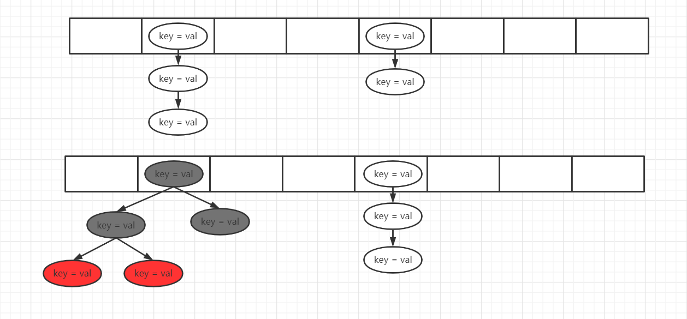

### 一、引入
```
本篇文章是分析JDK8中HashMap的源码, 相对于JDK7来说, JDK8增加了一种数据结构-红黑树, 相信大家在大学
期间学习数据结构的时候必然会对该数据结构感到不陌生, 红黑树本身是非常复杂的平衡树, 本篇文章不会非常
仔细的将红黑树分析一遍, 因为这必然不是一篇文章能解决的, 不过相关的信息我会以链接的方式同步给大家
```

### 二、整体上理解HashMap
```java
我们先利用文字的方式来将JDK8中HashMap的原理大概的说一下, 之后再以源码的方式进行分析:

public class HashMap<K,V> {
  Node<K,V>[] table;
  int size;
  int modCount;
  int threshold;
  float loadFactor;
}

跟JDK7一样, 在HashMap中仍然是一个table数组来存储元素, 不同是的JDK8采用的是Node类来表示一个元素信
息, 其实Node和JDK7中的Entry对象的定义是一模一样的, 所以在这一块并没有区别, 而size仍然是表示
HashMap中元素的个数, modCount仍然是表示修改次数, threshold表示HashMap进行扩容时需要达到的元素个
数的阈值, loadFactor负载因子, 通过table.length和负载因子的乘积则得到threshold扩容阈值, 这些都跟
JDK中的一模一样

不同的是, 少了一个hashSeed参数的定义, 在分析JDK7中的源码中我也没仔细说过跟这个参数有关的, 因为
JDK8已经弃用该参数了, 我想一个主要的原因是, JDK7中通过灵活的使用该参数来减少哈希冲突(虽然大部分情
况下我们都不知道该参数怎么用或者没用过), 但是JDK8对于存储数据结构的变化(由链表变为了链表 + 红黑树)
能够保证即使在出现哈希冲突时, 也能够很好的保证HashMap的性能了

在JDK8中的HashMap, 存储的结构如下图所示, 在大多数情况下, table数组中存储的是一个链表, 链表中的元
素为Node类型, 当一个链表中元素个数达到了指定的阈值后, 就会升级为红黑树, 这个操作称之为树化, 由图中
第二个table可以看到, Node数组会同时出现红黑树和链表的情况=======接下来我们看看Node节点相关的定义

static class Node<K,V> implements Map.Entry<K,V> {
    final int hash;
    final K key;
    V value;
    Node<K,V> next;
}

static class Entry<K,V> extends HashMap.Node<K,V> {
    Entry<K,V> before, after;
    Entry(int hash, K key, V value, Node<K,V> next) {
        super(hash, key, value, next);
    }
}

static final class TreeNode<K,V> extends LinkedHashMap.Entry<K,V> {
        TreeNode<K,V> parent;  // red-black tree links
        TreeNode<K,V> left;
        TreeNode<K,V> right;
        TreeNode<K,V> prev;    // needed to unlink next upon deletion
        boolean red;
}

首先Node节点的定义跟JDK7中的Entry对象一模一样, 通过next来形成一个链表, JDK8中的Entry存在于
LinkedHashMap中, 这个我们可以先不用理会, 最为重要的是TreeNode继承于LinkedHashMap.Entry,
TreeNode是红黑树节点的定义, 可以看到, 其是Node的子类, 从而table这个数组中可以同时存储TreeNode和
Node节点, 再来仔细看看TreeNode节点, 除了prev这个属性外, 其他都是一个红黑树节点必须持有的属性!!

再来说说HashMap的添加逻辑吧, 利用需要添加的key-value中的key得到一个hashCode哈希值, 然后利用这个
哈希值跟table.length - 1进行与操作获取到一个索引X, 从而可以将key-value添加到索引X这个位置, 如果
这个位置没有值, 那么就直接创建一个Node放进去就好了, 如果这个位置有值了, 那么就要判断是否是
TreeNode, 如果是TreeNode, 那么就走红黑树的添加逻辑了, 如果不是, 那么就走链表的添加逻辑

如果对红黑树有所了解的话, 我们可以很容易的想到, 对于一个索引位置下为红黑树的数据结构, 该索引位置中
第一个元素就是红黑树的root节点, 而各种增删改查操作其实都应该定义在TreeNode中的
```



### 三、聊聊红黑树
#### 3.1、红黑树中元素的比较方式
```
我们知道, 往一棵二叉树中添加元素X, 需要从root节点开始, 需要将元素X和root节点进行比较, 如果元素X比
root节点小, 则将元素X往左子树中添加, 反之则往右子树中添加, 所以很重要的一点就是, 往红黑树中添加的
元素是需要具备可比较性的, 通常情况下, 我们定义的一个对象, 有hashCode方法和equals方法, 在操作
HashMap的时候通过hashCode方法来定位索引位置, 通过equals来判断是否链表/红黑树中存在相同的元素, 这
样可以判断两个元素是否相等, 但是却没法判断两个元素的大小, 因为两个不一样的元素, hashCode可能会是
相同的, 而红黑树中却必须要求元素具备可比较性才能判断往左子树还是右子树中添加, 所以我们需要先来了解
下在HashMap中红黑树是如何对不具备比较性的元素进行比较的, 假设我们添加元素X:
  <1> 第一步, 通过hashCode来进行比较, 如果hashCode能比较出来, 那么就用这个比较结果, 如果不能则2
  <2> 此时hashCode一定是相等的, 那么就先用equals来判断是否元素是相等的, 如果相等, 那么就说明找到
      了目标元素, 如果是添加操作, 那么只需要替换value值就好了, 如果equals都不相等, 那么就一定要
      继续找下去, 这个时候就迷茫了, 没法判断应该往左边找还是往右边找, 于是走3
  <3> 如果元素X实现了Comparable接口, 那么就利用Comparable接口来进行比较, 如果Comparable接口返回
      的值仍然是相等的, 那么就走<4>, 如果没有实现Comparable接口, 也是走<4>, 如果Comparable接口
      返回相等, 这个时候是不能认为元素X和当前元素是相等的, 因为我们只能通过equals来判断是否相等, 
      而在第二步的时候, 已经判断为不相等了, 通过Comparable接口仅仅是为了判断应该往左子树还是右子
      树去查找元素
  <4> 这个时候, 已经没辙了, 如果我们是get操作, 即查找元素操作, 这个时候就只能通过将左子树和右子树
      都扫描一遍来查找对应的元素了, 但是!!如果我们是put操作, 必然需要将元素X放入到叶子节点, 所以
      还是要继续判断大小, 这个时候走<5>
  <5> 通过元素X和当前元素的Class.name即类名来判断大小, 如果类名相同, 这个时候还是没法得出谁大谁小
      于是走<6>
  <6> 利用内存地址来判断两个元素的大小!!!

所以总结一下, 在HashMap中红黑树对两个元素大小判断的时候, 顺序是这样的:
  hashCode -> equals -> Comparable接口 -> class.name -> 内存地址, 当Comparable接口返回相等的
  时候, 会优先其中对左子树和右子树的扫描, 看看是否存在元素X, 这个操作仅仅在添加操作即put方法才会
  看到, 在下一小节我们优先来分析红黑树的插入操作
```
#### 3.2、红黑树的插入操作
```java
final TreeNode<K,V> putTreeVal(HashMap<K,V> map, Node<K,V>[] tab, int h, K k, V v) {
    Class<?> kc = null;
    boolean searched = false;
    TreeNode<K,V> root = (parent != null) ? root() : this;
    for (TreeNode<K,V> p = root;;) {
        ........................................
    }
}

假设我们需要添加的元素为X

先来看这部分代码, map表示对应我们操作的HashMap对象, tab即该Map中存储元素的数组, k为key, v为
value, k和v构成一个元素X, 即要添加到HashMap中的键值对, h为k(key)经过哈希运算后得到的哈希值, kc
为keyClass的简写, 因为我们之后可能会对key的class.name进行比较

searched即为是否已经对红黑树中某棵子树进行查找过, 之所以要有这个参数, 是为了防止多次查找, 原因是
这样的: 经过  hashCode -> equals -> Comparable接口 这三步的判断后, 还是没法判断元素X的key和当前
元素的key谁大谁小, 那么这个时候就要从当前元素构成的子树中去查找是否存在元素X, 因为存在的话, 就直接
返回了, 如果不存在才继续添加, 那么假设没有查找到, 这个时候就要继续判断大小, 则利用
class.name -> 内存地址 这两个对元素X和当前元素的key进行大小判断, 得出应该往左子树添加还是右子树添
加, 假设得出是往左子树添加, 然而这个时候左子树可能还有很多元素, 即还没有到叶子节点, 这个时候就要继
续对该左子树元素和元素X进行比较了, 那么就可能重复上述的操作, 那么有了searched这个参数, 就可以减少
之后的子树查询的操作了, 因为在之前已经查询过, 确认了红黑树确实不存在该元素了

对上面的遍历进行解释之后, for循环便是对红黑树进行扫描了, 这里采用的是非递归的方法, 我们来看看这个
for循环的代码, 首先p就是当前节点, 一开始肯定是这棵红黑树中的root根节点了:
for (TreeNode<K,V> p = root;;) {
    int dir, ph; K pk;
    if ((ph = p.hash) > h)
        dir = -1;
    else if (ph < h)
        dir = 1;
    else if ((pk = p.key) == k || (k != null && k.equals(pk)))
        return p;
    else if ((kc == null &&
              (kc = comparableClassFor(k)) == null) ||
              (dir = compareComparables(kc, k, pk)) == 0) {
        if (!searched) {
            TreeNode<K,V> q, ch;
            searched = true;
            if (((ch = p.left) != null &&
                  (q = ch.find(h, k, kc)) != null) ||
                ((ch = p.right) != null &&
                  (q = ch.find(h, k, kc)) != null))
                return q;
        }
        dir = tieBreakOrder(k, pk);
    }
    ...........................................
}

dir就是对元素X和当前遍历的元素进行比较后的结果, 如果为1则表示往右添加, 如果为-1则表示往左边添加,
如果为0则表示判断是相等的, ph是当前元素p的hash哈希值, pk是当前元素p的key, 即要对pk和k(X.key)进行
比较大小, 我们先贴出上一小节的结论, 下面的括号表示第几步:
hashCode(1) -> equals(2) -> Comparable接口(3) -> class.name(4) -> 内存地址(5)

如果ph > h, 如果当前元素的key大于元素X的key, 则元素X应该添加到当前元素的左子树上, 即dir为-1, 反之
则为1, 这些操作对应上面的(1), 如果ph = h, 则说明要走(2)了, 可以看到, 如果equals相等了, 那么就直
接返回p了, 因为红黑树中已经存在了这个元素, 如果还没有得出结果, 则利用comparableClassFor获取k(待
添加的元素X的key)是否是Comparable接口的实现类, 如果是则利用compareComparables对k和pk进行比较,
如果还相等, 那么就开始在p这个元素的左子树和右子树中进行元素的查找, 即if(!searched){}这个判断中完
成的功能, 如果找到了, 那么就直接返回了, 如果没找到, 那么就利用tieBreakOrder()方法走(4)和(5)进行
判断, 到此为止, 一定能比较出pk和k谁大谁小了, 到此为止, 我们就对红黑树中比较元素的代码分析完了, 在
比较出大小后, 就要开始走后面的代码, 即:
for (TreeNode<K,V> p = root;;) {
    ........................................................
    TreeNode<K,V> xp = p;
    if ((p = (dir <= 0) ? p.left : p.right) == null) {
        Node<K,V> xpn = xp.next;
        TreeNode<K,V> x = map.newTreeNode(h, k, v, xpn);
        if (dir <= 0)
            xp.left = x;
        else
            xp.right = x;
        xp.next = x;
        x.parent = x.prev = xp;
        if (xpn != null)
            ((TreeNode<K,V>)xpn).prev = x;
        moveRootToFront(tab, balanceInsertion(root, x));
        return null;
    }
}

分析: 如果dir小于等于0, 则p更新成为p的左孩子节点, 否则更新成为右孩子节点, 更新完了以后p如果已经是
null了, 说明已经找到了叶子节点, 这个时候要开始执行添加操作, 反之则继续for循环, 直到找到叶子节点

利用newTreeNode创建出一个新的节点, 根据dir来将这个新的节点添加到左节点还是右节点, 更新next、
parent、prev等字段, prev字段的作用以及moveRootToFront我们之后再分析, 到此为止, 新元素X就已经添加
到了红黑树中的, 但是有可能本次添加造成了整棵树已经不满足红黑树的五条性质了, 所以需要对红黑树进行一
定的操作, 使得整棵树满足红黑树的性质, 即利用balanceInsertion()方法, 这个方法就不进行分析了, 如果
大家对红黑树不是那么的熟悉, 或者说想更进一步的了解红黑树的实现, 我在这里贴出我的github上的文章:
  https://github.com/fightzhong/collection-source-code-analyze

进入这个github后, 可以看到readme中的描述, 在最下面, 可以看到目录, 跟着目录去看我写的之前的文章,
相信会对大家理解红黑树有很大的帮助, 在这里提一下, 上面我是通过红黑树和四阶B树进行等价来进行理解的,
四阶B树也称为2-3-4树, 网上也有文章是通过三阶B树来进行等价的, 即2-3树, 然而四阶B树其实更加的完善一
点, 同时对红黑树的删除操作也进行了分析, 删除操作算是红黑树中最复杂的了, 即使是在理解了的基础上想要
手写出来也是有一定的难度的!!!, 再往后是我利用红黑树实现的一个HashMap, 大家有兴趣也可以看看, 到此
为止, 我们对红黑树的相关分析已经结束了, 有了这些基础的情况下, 我们再来看看JDK8的HashMap源码就非常
轻松了！！！！
```

### 四、HashMap的put方法源码分析
#### 4.1、put方法整体分析
```java
final V putVal(int hash, K key, V value, boolean onlyIfAbsent, boolean evict) {
    Node<K,V>[] tab; Node<K,V> p; int n, i;
    if ((tab = table) == null || (n = tab.length) == 0)
        n = (tab = resize()).length;
    if ((p = tab[i = (n - 1) & hash]) == null)
        tab[i] = newNode(hash, key, value, null);
    else {
        ....................................
    }
    ++modCount;
    if (++size > threshold)
        resize();
    afterNodeInsertion(evict);
    return null;
}

先来看看这一段代码, 首先是参数列表, key-value构成一个元素添加到HashMap中, hash是key的哈希值, 
onlyIfAbsent就是当HashMap中存在值的时候是否替换旧的值, evict字段在HashMap中是没有用到的, 这个字
段在上面代码中afterNodeInsertion这个方法中传入进去的, 该方法是一个空方法, 在LinkedHashMap中才会
用到, 所以我们就不用分析这个方法

第一个if判断, 如果table为空, 即HashMap中存储数据的数组还没初始化, 就调用resize方法, 该方法同时完
成了数组初始化和扩容的功能, 最后tab指向HashMap中存储数据的数组, n为数组的长度

第二个if判断, 利用hash & (n - 1)来计算出key-value应该放在哪个索引位置, 我们之后称key-value这个
需要新增的键值对为元素X, 如果该酸银位置为null, 说明一个元素都没有, 那么就直接创建一个Node节点并放
如到这个索引位置就可以了, 如果该索引下有节点了, 那么就走else了, 这个我们之后单独分析, 我们需要注意
到, 经过这个判断后, p已经指向了对应索引的第一个元素

当经过上面步骤后, 元素已经添加到了HashMap中, 这个时候就使得modCount加1, size也加1, 如果增加之后
size已经到达了阈值, 那么就调用resize方法进行扩容, 接下来我们来看看上面余留的else分支的代码:

Node<K,V> e; K k;
if (p.hash == hash &&
    ((k = p.key) == key || (key != null && key.equals(k))))
    e = p;
else if (p instanceof TreeNode)
    e = ((TreeNode<K,V>)p).putTreeVal(this, tab, hash, key, value);
else {
    ..........................
}
if (e != null) { // existing mapping for key
    V oldValue = e.value;
    if (!onlyIfAbsent || oldValue == null)
        e.value = value;
    afterNodeAccess(e);
    return oldValue;
}

先来看看第一个判断, 经过上面的代码后, p指向的是该索引位置下第一个元素, 如果p的哈希值和元素X的key
的哈希值一样, 并且能通过==或者equals判断出相等, 那么就表示HashMap中已经存在这个元素了, 即走到了
最后的if判断

最后这个if判断表示, 如果添加元素X时, X已经存在于HashMap中了, 这个时候就根据onlyIfAbsent来判断是
否需要替换原有的值, 最后调用afterNodeAccess方法, 该方法是一个空方法

如果第一个判断没有满足, 这个时候优先判断p这个节点是否是TreeNode, 如果是则调用红黑树的添加节点操作
这个我们在之前已经进行了详细分析

如果不是TreeNode, 那么就走到了else语句块:
else {
    for (int binCount = 0; ; ++binCount) {
        if ((e = p.next) == null) {
            p.next = newNode(hash, key, value, null);
            if (binCount >= TREEIFY_THRESHOLD - 1) // -1 for 1st
                treeifyBin(tab, hash);
            break;
        }
        if (e.hash == hash &&
            ((k = e.key) == key || (key != null && key.equals(k))))
            break;
        p = e;
    }
}

这个其实就是一个链表的添加操作了, 不同的是有一个binCount, 该字段用于表示链表在未添加完元素X时的长
度, 之所以这样说, 是因为我们可用看到if ((e = p.next) == null)表示遍历到了链表的尾部, 这个时候创
建一个新的节点, 并用p.next指向了, 但是这个时候binCount还是没有进行加1操作的, 由于binCount从0开始
所以当binCount为7的时候, 表示链表中有8个元素了, 而当binCount >= 7的时候, 就执行了treeifyBin方法

即当链表中元素个数大于8个的时候(加上元素X就是9个元素), 就会执行treeifyBin方法, 这个方法称为树化,
即将一条链表转换为一棵红黑树, 接下来我们来看看这个方法
```

#### 4.2、treeifyBin树化
```java
final void treeifyBin(Node<K,V>[] tab, int hash) {
    int n, index; Node<K,V> e;
    if (tab == null || (n = tab.length) < MIN_TREEIFY_CAPACITY)
        resize();
    else if ((e = tab[index = (n - 1) & hash]) != null) {
        TreeNode<K,V> hd = null, tl = null;
        do {
            TreeNode<K,V> p = replacementTreeNode(e, null);
            if (tl == null)
                hd = p;
            else {
                p.prev = tl;
                tl.next = p;
            }
            tl = p;
        } while ((e = e.next) != null);
        if ((tab[index] = hd) != null)
            hd.treeify(tab);
    }
}

这里增加了一个判断, 如果数组的长度小于MIN_TREEIFY_CAPACITY(64), 则不会进行树化, 而是执行扩容的
操作, 所以我们得出一个结论, 当一个链表的长度大于8并且HashMap中元素个数大于等于64的时候, 才会执行
树化, 否则通过扩容来进行处理

当满足树化条件后, 走到了else, e被赋值为链表的第一个节点, 然后通过一个do..while语句, 将这个链表的
所有Node节点转换为TreeNode节点, 并且将prev字段补充完成, 从而将一个单向链表变为了一个双向链表, 这
个prev字段之后会有一定的作用, 之后再分析, 最后调用treeify来进行树化, 参数是tab, 而treeify是
TreeNode的方法, hd表示的是整个双向链表的第一个元素

final void treeify(Node<K,V>[] tab) {
    TreeNode<K,V> root = null;
    for (TreeNode<K,V> x = this, next; x != null; x = next) {
        next = (TreeNode<K,V>)x.next;
        x.left = x.right = null;
        if (root == null) {
            x.parent = null;
            x.red = false;
            root = x;
        }
        else {
            .........................
        }
    }
    moveRootToFront(tab, root);
}

首先我们可以了解到的是, 我们需要操作的这个链表, 目前已经是一个双向链表, 上面这段代码, 通过root这个
变量来重新构造一棵红黑树, 一开始, root为空的时候, 将其指向链表的第一个元素, 在下一次循环过来后, 
就走的是else语句块了, else语句块我就不仔细分析了, 跟我们一开始分析的红黑树的添加操作基本是一样的

经过该for循环, root已经是一棵红黑树了, 这个时候, 我们想要替换掉对应索引下的链表, 在上面操作中是
通过moveRootToFront完成的, root节点虽然一开始指向的是双向链表的第一个节点, 但是随着往红黑树中添加
元素, 会发生左旋、右旋、上溢等操作, 从而导致根节点已经不一定是双向链表的第一个节点了, 所以我们需要
将这个root节点替换掉对应索引的元素, 其实很简单, 我们需要理解的是, 目前从root出发是一棵红黑树, 但是
与此同时, 双向链表是没有发生改变的, 换句话说, 目前同时维护了一个双向链表和红黑树, 我们需要将root
从双向链表中抽离出来, 然后放到双向链表的首部, 这样就完成了从root出发, 既可以通过left、right两个
属性以红黑树的形式访问该对应索引下的数据, 又可以以next、prev两个属性以双向链表的形式访问该对应索引
下的数据
```

#### 4.3、总结
```
到此为止, 整个put方法几乎已经分析完了, 其实对于JDK8HashMap的分析也基本结束了, 有了上面的分析下,去
看get方法会很轻松, 但是remove方法相对比较麻烦一点, 涉及到了红黑树转链表的过程等等, 但是也还好, 还
有就是从红黑树中删除操作也还好, 难的是删除完以后维护红黑树性质的那一段

最后还有一个resize扩容方法, 该方法也不进行分析了, 大概的讲解一下扩容的逻辑:
  扩容是数组的大小增大一倍, 我们知道, 数组的大小是二的幂次方, 假设原来的容量是8, 即0000 1000, 扩
  容后的容量为0001 0000, 这个新的容量中的1位置我称为位置x, 因为是与运算, 所以扩容后一个索引下的
  链表 / 红黑树经过与运算后, 新的索引为止一定是只有两种情况, 当该链表/红黑树中的元素的key的
  hashCode在第x位为0的时候, 那么该hashCode与新的容量进行与操作仍然是原来的索引位置, 但是当第x位
  为1的时候, 新的索引位置就等于旧的容量 + 旧的索引位置, 这一段推倒大家好好理解下, 是resize方法的
  核心

  遍历该索引下的所有元素, 只会有两种索引, 分别对这两种索引构成对应的链表, 然后添加到对应索引的位置
  这样就完成了迁移操作, 如果一棵红黑树分成两部分以后, 分开的每一部分如果数量少于了阈值, 就会退化成
  一条链表
```
